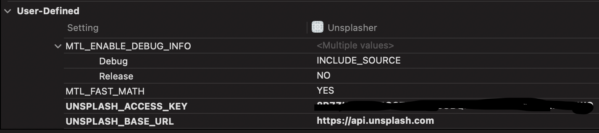

# Unsplasher

Do some unsplashed things with Unsplash API.

|   |   |   |   |
|--|--|--|--|
|||||

## Requirement
- Set Unsplash API Access Key
  - 

## RxSwift + ReactorKit + CleanArchitecture + Modularization(WIP)

## MVC 
- [branch](../../tree/feat/MVC)
- [Pull request](https://github.com/kyungpyoda/Unsplasher/pull/2)
