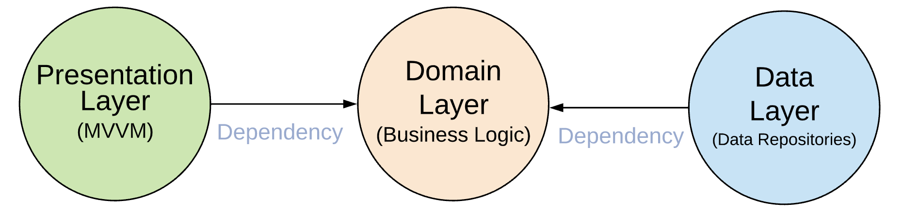
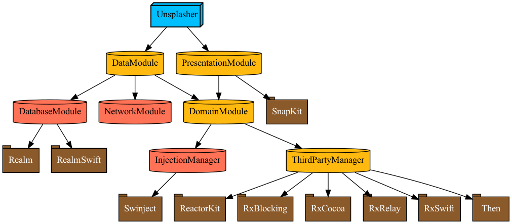

# Unsplasher

Do some unsplashed things with Unsplash API.  
**RxSwift + ReactorKit + CleanArchitecture + Modularization(with Tuist)**  

|   |   |   |
|--|--|--|
||||

  
  

## Requirement
- [Tuist v2.7.2](https://github.com/tuist/tuist)
  - Install Tuist
    - `curl -Ls https://install.tuist.io | bash`
    - `tuist install 2.7.2`
  - Generate project `tuist generate`
- Set Unsplash API Access Key
  - 

## TODO
- DI 개선
  - Reactor 생성자의 Bastard Injection 개선, property wrapper 이용
  - Swinject -> Needle (컴파일 타임에 잘못된 의존성 계층 확인 가능)
- ThirdPartyManager의 구조적 문제 해결 (관련: https://github.com/kyungpyoda/LinkTestApp)
- DomainModule에서 ThirdParthManager 분리
- PresentationModule의 화면 단위 모듈화
- Tuist 안쓰고 서브 프로젝트로 모듈화, SPM만으로 모듈화

## Reference
- [민소네님 블로그](http://minsone.github.io)
